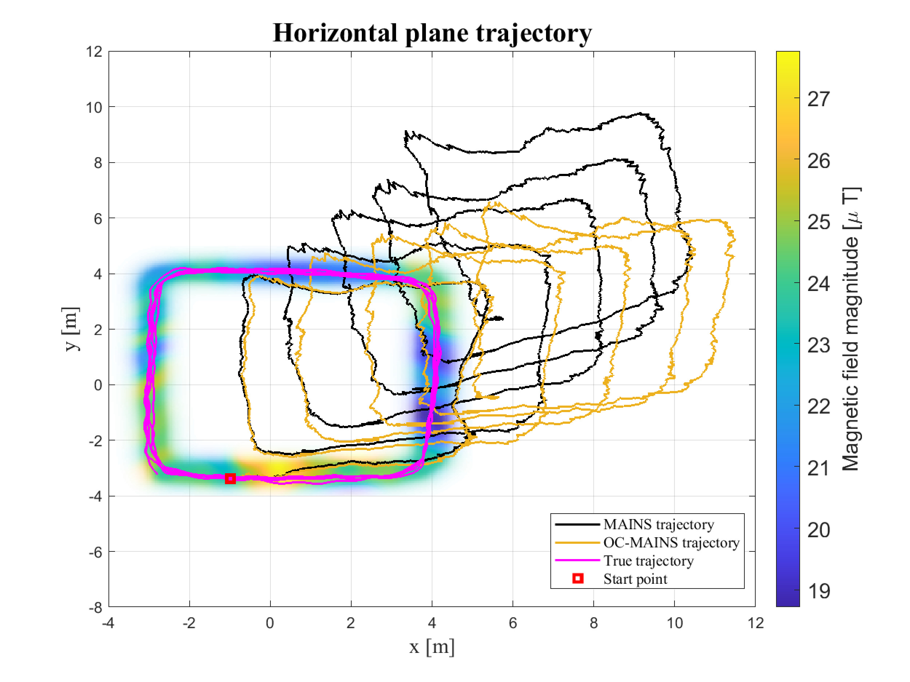

# An Observability-Constrained Magnetic-Field-Aided Inertial Navigation System

## Description

This repository contains the implementation of the OC-MAINS algorithm for the paper [An Observability-Constrained Magnetic-Field-Aided Inertial Navigation System](https://arxiv.org/abs/2406.02161). The algorithm aims to solve the inconsistent estimate of the yaw in the MAINS.

## Usage

Run `main_simulation.m` to see the results of the simulation.

Run `main_realexp.m` to see the results of the real data experiment.